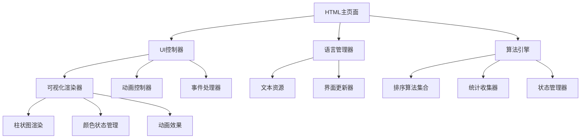

# 设计文档

## 概述

八大排序算法可视化网页是一个基于纯前端技术的教育工具，通过动画演示帮助用户理解排序算法。系统采用模块化架构，分为算法引擎、UI控制器、语言管理器和可视化渲染器四个核心组件。

## 架构

### 系统架构图



### 文件结构

```
sorting-visualization/
├── index.html              # 主页面文件
├── sorting-algorithms.js   # 排序算法实现
├── ui-handler.js          # UI交互和动画控制
└── language-manager.js    # 多语言支持
```

## 组件和接口

### 1. 算法引擎 (sorting-algorithms.js)

**核心类：SortingEngine**

```javascript
class SortingEngine {
    constructor(visualizer) {
        this.visualizer = visualizer;
        this.array = [];
        this.stats = {
            comparisons: 0,
            swaps: 0,
            startTime: 0,
            pointers: {}
        };
        this.isPaused = false;
        this.isRunning = false;
    }
    
    // 主要方法
    async bubbleSort(array, speed);
    async selectionSort(array, speed);
    async insertionSort(array, speed);
    async mergeSort(array, speed);
    async quickSort(array, speed);
    async heapSort(array, speed);
    async countingSort(array, speed);
    async radixSort(array, speed);
    
    // 辅助方法
    async compare(i, j, speed);
    async swap(i, j, speed);
    pause();
    resume();
    reset();
}
```

**算法接口规范：**
- 所有排序方法都是异步函数，支持动画延迟
- 每次比较和交换操作都通过可视化器更新界面
- 统一的暂停/继续机制
- 实时统计数据收集

### 2. UI控制器 (ui-handler.js)

**核心类：UIHandler**

```javascript
class UIHandler {
    constructor() {
        this.visualizer = new Visualizer();
        this.sortingEngine = new SortingEngine(this.visualizer);
        this.languageManager = new LanguageManager();
        this.currentAlgorithm = 'bubbleSort';
        this.arraySize = 30;
        this.speed = 50;
        this.displayMode = 'chinese';
        this.teachingMode = false;
    }
    
    // 主要方法
    initializeUI();
    generateNewArray();
    startSorting();
    pauseSorting();
    resumeSorting();
    resetSorting();
    changeAlgorithm(algorithm);
    changeArraySize(size);
    changeSpeed(speed);
    toggleLanguage();
    toggleDisplayMode(mode);
    toggleTeachingMode();
    showAlgorithmInfo(algorithm);
    showComplexityComparison();
    createComplexityTable(data);
    createComplexityColorLegend();
    getComplexityColor(cellText, cellIndex);
}
```

**可视化器类：Visualizer**

```javascript
class Visualizer {
    constructor(container) {
        this.container = container;
        this.bars = [];
        this.activeIndices = new Set();
        this.sortedIndices = new Set();
    }
    
    // 渲染方法
    renderArray(array);
    highlightBars(indices, color);
    animateSwap(i, j);
    animateComparison(i, j);
    markAsSorted(indices);
    showPointers(pointers);
    updateStats(stats);
    updateStepDescription(description);
}
```

### 3. 语言管理器 (language-manager.js)

**核心类：LanguageManager**

```javascript
class LanguageManager {
    constructor() {
        this.currentLanguage = 'zh';
        this.translations = {
            zh: { /* 中文文本资源 */ },
            en: { /* 英文文本资源 */ }
        };
    }
    
    // 主要方法
    setLanguage(lang);
    getText(key);
    updateAllTexts();
    getAlgorithmInfo(algorithm);
    getStepDescription(step, params);
}
```

## 数据模型

### 1. 数组元素模型

```javascript
class ArrayElement {
    constructor(value, index) {
        this.value = value;        // 元素值
        this.index = index;        // 原始索引
        this.state = 'unsorted';   // 状态：unsorted, comparing, swapping, sorted, pivot
        this.position = index;     // 当前位置
    }
}
```

### 2. 算法信息模型

```javascript
class AlgorithmInfo {
    constructor(name) {
        this.name = name;
        this.timeComplexity = {
            best: '',
            average: '',
            worst: ''
        };
        this.spaceComplexity = '';
        this.stable = boolean;
        this.description = '';
        this.code = '';
        this.useCases = [];
        this.advantages = [];
        this.disadvantages = [];
    }
}
```

### 3. 统计数据模型

```javascript
class SortingStats {
    constructor() {
        this.comparisons = 0;      // 比较次数
        this.swaps = 0;           // 交换次数
        this.startTime = 0;       // 开始时间
        this.elapsedTime = 0;     // 已用时间
        this.sortedCount = 0;     // 已排序元素数量
        this.pointers = {};       // 当前指针位置
        this.currentStep = '';    // 当前步骤描述
        this.detailedStep = '';   // 详细步骤说明
        this.stepType = '';       // 步骤类型：comparing, swapping, moving, partitioning, merging, heapifying
        this.stepParams = {};     // 步骤参数（数值、位置等）
    }
}
```

### 4. 详细步骤说明模型

```javascript
class StepDescription {
    constructor(type, params, language = 'zh') {
        this.type = type;         // 步骤类型
        this.params = params;     // 步骤参数
        this.language = language; // 显示语言
        this.template = '';       // 模板字符串
        this.formatted = '';      // 格式化后的说明
    }
    
    // 步骤类型枚举
    static TYPES = {
        COMPARING: 'comparing',           // 比较操作
        SWAPPING: 'swapping',            // 交换操作
        MOVING: 'moving',                // 移动操作
        INSERTING: 'inserting',          // 插入操作
        PARTITIONING: 'partitioning',    // 分区操作
        MERGING: 'merging',              // 合并操作
        HEAPIFYING: 'heapifying',        // 堆化操作
        EXTRACTING: 'extracting',        // 提取操作
        ROUND_COMPLETE: 'round_complete', // 轮次完成
        ALGORITHM_COMPLETE: 'algorithm_complete' // 算法完成
    };
}
```

### 5. 复杂度颜色编码模型

```javascript
class ComplexityColorLegend {
    constructor(language = 'zh') {
        this.language = language;
        this.colorMappings = {
            'O(1)': { color: '#28a745', label: { zh: '常数时间', en: 'Constant Time' } },
            'O(n)': { color: '#17a2b8', label: { zh: '线性时间', en: 'Linear Time' } },
            'O(n log n)': { color: '#20c997', label: { zh: '对数线性', en: 'Linearithmic' } },
            'O(n²)': { color: '#fd7e14', label: { zh: '平方时间', en: 'Quadratic Time' } },
            'O(log n)': { color: '#6f42c1', label: { zh: '对数时间', en: 'Logarithmic Time' } },
            'special': { color: '#ffc107', label: { zh: '特殊复杂度', en: 'Special Complexity' } }
        };
    }
    
    // 获取复杂度对应的颜色
    getComplexityColor(complexityText) {
        if (complexityText.includes('O(1)')) return this.colorMappings['O(1)'].color;
        if (complexityText.includes('O(n)') && !complexityText.includes('log') && !complexityText.includes('²')) 
            return this.colorMappings['O(n)'].color;
        if (complexityText.includes('O(n log n)')) return this.colorMappings['O(n log n)'].color;
        if (complexityText.includes('O(n²)')) return this.colorMappings['O(n²)'].color;
        if (complexityText.includes('O(log n)')) return this.colorMappings['O(log n)'].color;
        if (complexityText.includes('k') || complexityText.includes('d')) 
            return this.colorMappings['special'].color;
        return '#ffffff'; // 默认白色
    }
    
    // 创建颜色图例HTML
    createLegendHTML() {
        const title = this.language === 'zh' ? '复杂度颜色编码' : 'Complexity Color Coding';
        let legendHTML = `
            <div class="complexity-color-legend" style="
                display: flex;
                flex-wrap: wrap;
                gap: 15px;
                margin: 20px 0;
                padding: 15px;
                background: rgba(255, 255, 255, 0.05);
                border-radius: 8px;
                border-left: 4px solid #4a9eff;
            ">
                <h3 style="width: 100%; color: #4a9eff; margin-bottom: 10px; font-size: 16px;">${title}</h3>
        `;
        
        Object.entries(this.colorMappings).forEach(([complexity, info]) => {
            if (complexity !== 'special') {
                legendHTML += `
                    <div class="legend-item" style="
                        display: flex;
                        align-items: center;
                        gap: 8px;
                        font-size: 12px;
                    ">
                        <div class="legend-color" style="
                            width: 16px;
                            height: 16px;
                            border-radius: 3px;
                            background: ${info.color};
                        "></div>
                        <span>${complexity} - ${info.label[this.language]}</span>
                    </div>
                `;
            }
        });
        
        // 特殊复杂度项
        const specialInfo = this.colorMappings['special'];
        legendHTML += `
            <div class="legend-item" style="
                display: flex;
                align-items: center;
                gap: 8px;
                font-size: 12px;
            ">
                <div class="legend-color" style="
                    width: 16px;
                    height: 16px;
                    border-radius: 3px;
                    background: ${specialInfo.color};
                "></div>
                <span>O(n+k), O(d(n+k)) - ${specialInfo.label[this.language]}</span>
            </div>
        `;
        
        legendHTML += '</div>';
        return legendHTML;
    }
}
```

## 正确性属性

*属性是一种特征或行为，应该在系统的所有有效执行中保持为真——本质上是关于系统应该做什么的正式声明。属性作为人类可读规范和机器可验证正确性保证之间的桥梁。*

基于需求分析，以下是系统必须满足的核心正确性属性：

### 排序算法正确性属性

**属性 1: 排序结果正确性**
*对于任何* 输入数组和任何排序算法，排序完成后的数组应该是完全有序的（升序）
**验证需求: 1.1, 1.4**

**属性 2: 排序算法通用性**
*对于任何* 大小在5到100之间的数组，所有8种排序算法都应该能够无错误地完成排序
**验证需求: 1.2**

**属性 3: 统计数据一致性**
*对于任何* 排序过程，记录的比较次数和交换次数应该与实际执行的操作次数一致
**验证需求: 1.5**

### 用户界面属性

**属性 4: 可视化状态一致性**
*对于任何* 数组元素状态变化，可视化显示的颜色应该与元素的实际状态（未排序、比较中、交换中、已排序、基准）保持一致
**验证需求: 3.2**

**属性 5: 数值显示准确性**
*对于任何* 数组元素，柱状图的高度应该与元素数值成正比，且顶部显示的数值和底部显示的索引应该准确
**验证需求: 3.1, 3.5**

**属性 6: 控制参数有效性**
*对于任何* 用户输入的数组大小（5-100）和排序速度（10-200ms），系统应该接受并正确应用这些参数
**验证需求: 2.3, 2.4**

### 交互控制属性

**属性 7: 暂停继续一致性**
*对于任何* 排序过程，暂停后继续执行应该从完全相同的状态恢复，不丢失任何进度信息
**验证需求: 6.3, 6.4**

**属性 8: 重置状态完整性**
*对于任何* 排序状态，重置操作应该将系统恢复到初始未排序状态，清除所有统计数据和可视化标记
**验证需求: 6.5**

**属性 9: 数组生成规范性**
*对于任何* 指定的数组大小，生成新数组功能应该创建包含该确切数量元素的随机数组
**验证需求: 6.1**

### 多语言支持属性

**属性 10: 语言切换完整性**
*对于任何* 界面元素，当切换语言时，所有文本内容（按钮标签、步骤说明、算法信息、弹窗内容）都应该更新为目标语言
**验证需求: 5.2, 5.3, 5.4, 5.5**

**属性 11: 显示模式一致性**
*对于任何* 显示模式切换，底部步骤面板的内容应该立即更新为对应模式的格式（中文说明、英文说明或代码高亮）
**验证需求: 8.3, 8.4**

### 教学功能属性

**属性 12: 教学模式交互性**
*对于任何* 启用教学模式的排序步骤，系统应该显示解释提示并等待用户确认后才继续下一步
**验证需求: 12.1, 12.3**

**属性 13: 算法信息完整性**
*对于任何* 选择的排序算法，系统应该显示完整的算法信息，包括时间复杂度、空间复杂度、稳定性和算法说明
**验证需求: 4.1, 4.2, 4.3**

### 系统集成属性

**属性 14: 弹窗状态控制**
*对于任何* 算法介绍弹窗的打开和关闭操作，"开始排序"按钮的启用状态应该与弹窗状态相反（弹窗开启时按钮禁用，弹窗关闭时按钮启用）
**验证需求: 7.3, 7.4**

**属性 15: 实时统计更新**
*对于任何* 排序执行过程中的操作，统计信息（比较次数、交换次数、耗时、指针位置、已排序数量）应该实时准确更新
**验证需求: 4.4, 4.5**

**属性 16: 详细步骤说明准确性**
*对于任何* 排序操作（比较、交换、插入、移动、分区、合并、堆化），当前步骤面板应该显示包含具体数值和位置信息的详细说明
**验证需求: 13.1, 13.2, 13.3, 13.4, 13.5, 13.6, 13.7**

**属性 17: 步骤说明语言一致性**
*对于任何* 语言切换操作，所有详细步骤说明都应该更新为目标语言，并保持数值和位置信息的准确性
**验证需求: 13.9**

**属性 18: 步骤说明格式化正确性**
*对于任何* 步骤说明中的关键数值和位置信息，应该使用突出显示的格式（不同颜色或样式）以提高可读性
**验证需求: 13.10**

**属性 19: 复杂度颜色编码一致性**
*对于任何* 复杂度对比表中的复杂度值，应该根据复杂度类型显示对应的颜色：O(1)显示绿色，O(n)显示蓝色，O(n log n)显示青色，O(n²)显示橙色，O(log n)显示紫色，特殊复杂度显示黄色
**验证需求: 11.6**

**属性 20: 复杂度图例显示完整性**
*对于任何* 复杂度对比表的显示，应该在表格上方显示包含所有复杂度类型及其对应颜色和说明的图例
**验证需求: 11.7**

**属性 21: 复杂度图例语言一致性**
*对于任何* 语言切换操作，复杂度颜色编码图例中的文本说明应该更新为目标语言
**验证需求: 11.8**

<function_calls>
<invoke name="prework">
<parameter name="featureName">sorting-visualization

## 错误处理

### 1. 输入验证错误

**数组大小验证：**
- 范围检查：确保数组大小在5-100之间
- 类型检查：确保输入为有效整数
- 错误处理：显示友好的错误提示，恢复到默认值

**排序速度验证：**
- 范围检查：确保速度在10-200ms之间
- 边界处理：自动调整超出范围的值
- 用户反馈：实时显示当前设置的速度值

### 2. 算法执行错误

**数组访问错误：**
- 边界检查：防止数组越界访问
- 空数组处理：优雅处理空数组或单元素数组
- 异常捕获：捕获并记录算法执行中的异常

**动画渲染错误：**
- DOM元素检查：确保可视化容器存在
- 状态同步：防止动画状态与数据状态不一致
- 性能保护：限制动画频率防止浏览器卡顿

### 3. 用户交互错误

**并发操作处理：**
- 状态锁定：防止在排序过程中启动新的排序
- 操作队列：合理处理快速连续的用户操作
- 状态恢复：确保异常中断后能正确恢复状态

**浏览器兼容性：**
- API检查：检查浏览器对所需API的支持
- 降级方案：为不支持的功能提供替代方案
- 错误报告：向用户报告兼容性问题

## 测试策略

### 1. 单元测试

**算法正确性测试：**
- 测试每种排序算法的基本功能
- 验证边界情况（最小/最大数组、已排序数组、逆序数组）
- 检查特殊输入（重复元素、单元素、空数组）

**UI组件测试：**
- 测试各个UI组件的渲染和交互
- 验证事件处理器的正确绑定
- 检查样式和布局的正确应用

**语言管理测试：**
- 测试语言切换功能
- 验证文本资源的完整性
- 检查多语言内容的正确显示

### 2. 属性基础测试

**排序算法属性测试：**
- 使用随机生成的数组测试所有排序算法
- 验证排序结果的正确性（属性1）
- 测试不同大小数组的处理能力（属性2）
- 验证统计数据的准确性（属性3）

**用户界面属性测试：**
- 测试可视化状态与实际状态的一致性（属性4）
- 验证数值显示的准确性（属性5）
- 测试控制参数的有效性（属性6）

**交互控制属性测试：**
- 测试暂停继续功能的一致性（属性7）
- 验证重置功能的完整性（属性8）
- 测试数组生成的规范性（属性9）

**多语言属性测试：**
- 测试语言切换的完整性（属性10）
- 验证显示模式的一致性（属性11）

**教学功能属性测试：**
- 测试教学模式的交互性（属性12）
- 验证算法信息的完整性（属性13）

**系统集成属性测试：**
- 测试弹窗状态控制（属性14）
- 验证实时统计更新（属性15）

### 3. 集成测试

**端到端工作流测试：**
- 测试完整的排序可视化流程
- 验证多个功能的协同工作
- 检查用户典型使用场景

**性能测试：**
- 测试大数组排序的性能表现
- 验证动画流畅性和响应性
- 检查内存使用和清理

**兼容性测试：**
- 测试不同浏览器的兼容性
- 验证不同屏幕尺寸的响应式布局
- 检查移动设备的触摸交互

### 4. 测试配置

**属性基础测试配置：**
- 每个属性测试运行最少100次迭代
- 使用随机数据生成器创建测试用例
- 每个测试标记格式：**Feature: sorting-visualization, Property {number}: {property_text}**

**测试框架选择：**
- 单元测试：使用原生JavaScript测试框架（如Jest或Mocha）
- 属性测试：使用fast-check库进行属性基础测试
- DOM测试：使用jsdom或浏览器环境进行UI测试

**测试覆盖率目标：**
- 代码覆盖率：至少90%
- 功能覆盖率：100%（所有需求都有对应测试）
- 属性覆盖率：所有15个正确性属性都有对应的属性测试

## 实现注意事项

### 1. 性能优化

**动画性能：**
- 使用requestAnimationFrame进行动画渲染
- 避免频繁的DOM操作，使用批量更新
- 实现动画队列管理，防止动画堆积

**内存管理：**
- 及时清理事件监听器和定时器
- 避免内存泄漏，特别是在动画和异步操作中
- 合理管理大数组的内存占用

### 2. 用户体验

**响应式设计：**
- 使用CSS Grid和Flexbox实现灵活布局
- 提供移动设备友好的触摸交互
- 确保在不同屏幕尺寸下的可用性

**无障碍访问：**
- 提供键盘导航支持
- 添加适当的ARIA标签
- 确保颜色对比度符合无障碍标准

### 3. 代码质量

**模块化设计：**
- 保持各模块的单一职责
- 使用清晰的接口定义模块间通信
- 便于测试和维护的代码结构

**错误处理：**
- 实现全面的错误捕获和处理
- 提供有意义的错误信息
- 确保系统在错误后能够恢复正常状态